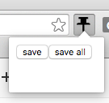

### Simple Pinboard for Chrome

This chrome extension is a simple interface to Pinboard that automatically adds
suggested tabs for you.



Hit `save` to add the current tab to your pinboard, or hit `save all` to add
all open tabs in the current window.

Because this application is not yet in the chrome web store, you will have to
build the application below and add the extension as an unpacked extension.

#### Contributing

To do development:
```bash
npm run dev
```

To simply build the application:
```bash
npm run build
```
